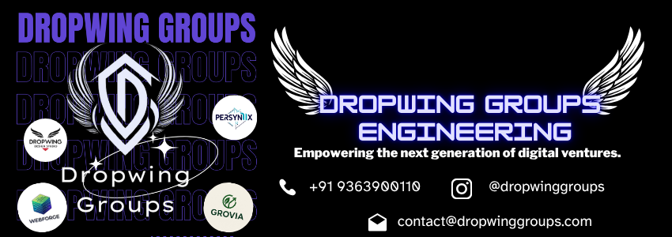
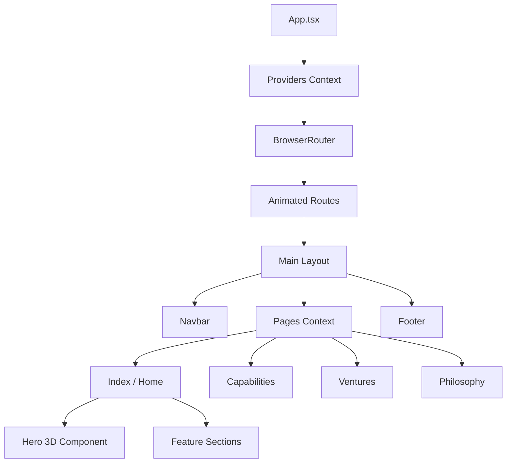

<div align="center">
  

  <h1>Dropwing Groups</h1>

  <p><strong>Enterprise-grade platform for Operational Sovereignty.</strong></p>

  <p>
    The era of advisory is over. Dropwing Groups builds, runs, and governs institutional-grade operating models. We don't just recommend the path. We walk it with you.
  </p>

  <p>
    <a href="#key-features">Features</a> •
    <a href="#tech-stack">Tech Stack</a> •
    <a href="#getting-started">Getting Started</a> •
    <a href="#architecture">Architecture</a>
  </p>

  <p>
    
    
    
    
    
  </p>
</div>

---

## 📑 Table of Contents

- [Overview](#overview)
- [Key Features](#key-features)
- [Screenshots](#screenshots)
- [Architecture](#architecture)
- [Tech Stack](#tech-stack)
- [Project Structure](#project-structure)
- [Getting Started](#getting-started)
- [Configuration](#configuration)
- [Scripts](#scripts)
- [Deployment](#deployment)
- [Code Style](#code-style)
- [License](#license)

---

## 🚀 Overview

**Dropwing Groups** is the premier digital presence and operational hub for enterprise clients seeking unparalleled digital infrastructure, synthetic intelligence integration, and brand sovereignty. 

This repository contains the frontend application for the public-facing enterprise platform. Designed with performance, accessibility, and high-end aesthetic appeal in mind, it utilizes kinetic typography, dynamic 3D elements, and smooth page transitions to deliver a premium user experience.

### **Ventures Ecosystem**
- **WebForge:** Next-generation web experiences.
- **Design Studio:** World-class digital design.
- **Elevix Pro:** Advanced operational tools.
- **PerSyniX:** Intelligent synthetic integrations.
- **Grovia:** Growth and scaling engines.

---

## ✨ Key Features

| Feature | Description |
| ------- | ----------- |
| **Immersive UI/UX** | Framer Motion animations and React Three Fiber 3D backgrounds. |
| **Enterprise Routing** | Complex nested routing with `react-router-dom` and page transitions. |
| **Design System** | Fully customized Tailwind CSS and `shadcn/ui` integration. |
| **Performant** | Built on Vite for lightning-fast HMR and optimized production builds. |
| **Type-Safe** | End-to-end type safety with TypeScript and Zod. |
| **Responsive** | Flawless execution across mobile, tablet, and desktop viewports. |
| **SEO Optimized** | `react-helmet-async` for dynamic metadata and search engine visibility. |

---

## 📸 Screenshots

### 📖 Comprehensive Visual Documentation

For a complete, screen-by-screen visual guide of all pages, features, and workflows, please refer to the **[Visual Documentation](docs/VISUAL_DOCUMENTATION.md)**.

### Desktop
> *Placeholder for desktop view*
> ``

### Mobile
> *Placeholder for mobile view*
> ``

### Dark Mode
> *Placeholder for dark mode view*
> ``

---

## 🏗 Architecture

### Component Architecture



---

## 💻 Tech Stack

| Category | Technology |
| :--- | :--- |
| **Frontend Framework** | React 18 |
| **Build Tool** | Vite |
| **Language** | TypeScript |
| **Styling** | Tailwind CSS, PostCSS |
| **UI Components** | shadcn/ui (Radix UI) |
| **Animations** | Framer Motion, Tailwind Animate |
| **3D Rendering** | Three.js, React Three Fiber, Drei |
| **Routing** | React Router DOM |
| **Data Fetching** | React Query (@tanstack/react-query) |
| **Form Handling** | React Hook Form, Zod |
| **Icons** | Lucide React |

---

## 📂 Project Structure

```text
src/
├── assets/           # Static assets, images, and brand files
├── components/       # Reusable React components
│   ├── 3d/           # Three.js & R3F components
│   ├── sections/     # Page-specific modular sections
│   └── ui/           # shadcn UI core components
├── data/             # Mock data and static content configurations
├── hooks/            # Custom React hooks
├── lib/              # Utility functions and configurations
├── pages/            # Top-level route components
├── test/             # Vitest test files and setup
└── types/            # Global TypeScript definitions
```

---

## 🏁 Getting Started

### Prerequisites
- [Node.js](https://nodejs.org/en/) (v18 or higher recommended)
- [npm](https://www.npmjs.com/) or [bun](https://bun.sh/)

### Installation

1. **Clone the repository:**
   ```bash
   git clone https://github.com/your-org/dropwing-groups.git
   cd dropwing-groups
   ```

2. **Install dependencies:**
   ```bash
   npm install
   # or
   bun install
   ```

### Configuration

### Environment Variables

| Variable | Description | Required | Example |
| :--- | :--- | :---: | :--- |
| `VITE_API_URL` | Backend API endpoint (if applicable) | No | `https://api.dropwing.com` |
| `VITE_APP_ENV` | Application environment state | No | `development` |

*Never expose secrets in the frontend environment variables.*

### Running the Application

**Development Mode:**
```bash
npm run dev
```
*The app will be available at `http://localhost:5173`*

**Production Build:**
```bash
npm run build
npm run preview
```

---

## 🚀 Deployment

This project is optimized for modern deployment platforms. 

### Vercel / Netlify
1. Connect your GitHub repository.
2. Build Command: `npm run build`
3. Output Directory: `dist`
4. Node Version: `18.x`

### Docker (Optional)
```dockerfile
# docs/Dockerfile.example
FROM node:18-alpine AS builder
WORKDIR /app
COPY package*.json ./
RUN npm ci
COPY . .
RUN npm run build

FROM nginx:alpine
COPY --from=builder /app/dist /usr/share/nginx/html
EXPOSE 80
CMD ["nginx", "-g", "daemon off;"]
```

---

## 🧪 Testing

The repository uses `vitest` and `@testing-library/react` for unit and component testing.

```bash
# Run tests
npm run test

# Run tests in watch mode
npm run test:watch
```

---

## 📏 Code Style

- **Formatting & Linting:** ESLint and Prettier (integrated).
- **Component Structure:** Functional components with React Hooks.
- **Styling:** Utility-first Tailwind classes merged via `tailwind-merge` and `clsx`.
- **Absolute Imports:** Configured via `tsconfig.paths` (e.g., `@/components/...`).

---

## 📄 License

Copyright © 2026 Dropwing Groups. All rights reserved. 
*(If this transitions to Open Source, standard MIT or Apache 2.0 terms apply).*

---

<div align="center">
  <p>Built with precision by <strong>Dropwing Groups</strong>.</p>
</div>
