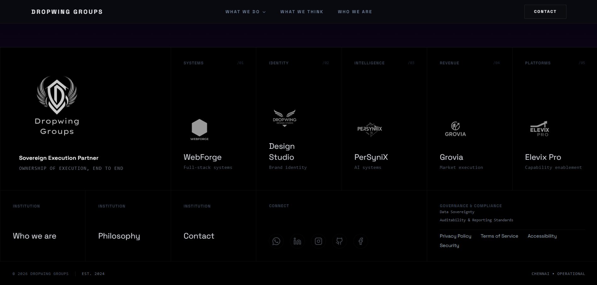

# 📖 Dropwing Groups - Visual & Component Architecture

This document serves as the definitive visual guide to the Dropwing Groups enterprise platform. It maps the visual interface (UI) directly to the underlying React components and file structures, acting as a visual wireframe for developers and designers.

## 📑 Table of Contents
- [Home Page Architecture](#home-page-architecture)
  - [1. Hero Section](#1-hero-section)
  - [2. Featured Insights](#2-featured-insights)
  - [3. The Problem (The Reality)](#3-the-problem)
  - [4. The Solution (Operating Model)](#4-the-solution)
  - [5. Call to Action (Engagement Gate)](#5-call-to-action)
- [Global Components](#global-components)
  - [Footer](#footer)

---

## Home Page Architecture

The Home Page (`src/pages/Index.tsx`) is constructed using modular section components. Below is the visual breakdown mapped to the exact files.

### 1. Hero Section
> **Component:** `src/components/Hero.tsx` | `src/components/HeroBackgroundV2.tsx`
> 
> **Purpose:** Grab attention with kinetic typography, 3D backgrounds, and the core "Operational Sovereignty" thesis.
> 
> 
> 
> **Technical Notes:**
> - Implements Framer Motion for scroll-linked animations.
> - Background is rendered using `@react-three/fiber` for the "Singularity" effect.

### 2. Featured Insights
> **Component:** `src/components/sections/FeaturedInsights.tsx`
> 
> **Purpose:** Highlight recent thought leadership, intelligence briefs, and ecosystem updates.
> 
> 
> 
> **Technical Notes:**
> - Relies on `framer-motion` for staggered card reveals.
> - Data mapped from internal content arrays.

### 3. The Problem (The Reality)
> **Component:** `src/components/sections/TheReality.tsx`
> 
> **Purpose:** Establish the core problem context ("The era of advisory is over") targeting enterprise pain points.
> 
> 
> 
> **Technical Notes:**
> - Typographic heavy layout utilizing `shadcn/ui` typography tokens.
> - High-contrast visual break in the page flow.

### 4. The Solution (Operating Model)
> **Component:** `src/components/sections/OperatingModel.tsx` & `src/components/sections/GovernanceScale.tsx`
> 
> **Purpose:** Explain the mechanics of Dropwing Groups' execution and how they solve the established problem.
> 
> 
> 
> **Technical Notes:**
> - Interactive process diagrams and grids.
> - Built with Tailwind CSS CSS Grid/Flexbox utilities for complex, responsive card arrangements.

### 5. Call to Action (Engagement Gate)
> **Component:** `src/components/sections/EngagementGate.tsx`
> 
> **Purpose:** The final interactive checkpoint guiding enterprise clients toward initiation.
> 
> 
> 
> **Technical Notes:**
> - Routes user to `/contact` upon interaction.
> - Uses hover effects and backdrop-blur styling for premium aesthetics.

---

## Global Components

### Footer
> **Component:** Included via `src/components/MainLayout.tsx`
> 
> **Purpose:** Persistent site-wide navigation, legal links, and brand sign-off.
> 
> 
> 
> **Technical Notes:**
> - Present on all standard pages wrapped by `MainLayout`.
> - Contains links to Privacy, Terms, Security, Accessibility.

---

> *Note: This visual guide directly connects UI screenshots to the codebase. As new UI features are added, place the screenshots in `docs/images/` and map them to their React components here.*
